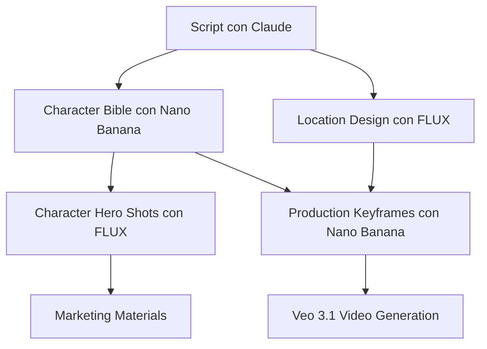

# 🎬 CONFIGURACIÓN DE MODELOS - VERSIÓN EXPERTO

## FILOSOFÍA

> "En cine lo que mata el proyecto no es que una pared no tenga 
> la textura perfecta, es que el 'actor' cambie entre planos."

Prioridad: **CONSISTENCIA > REALISMO EXTREMO**

---

## CONFIGURACIÓN POR FASE DE PRODUCCIÓN

### FASE 1: CHARACTER BIBLE (Pre-producción)

**Objetivo:** Mismo "actor digital" en todas las variaciones

```typescript
// supabase/functions/generate-character/index.ts
const CHARACTER_ENGINE = 'nano-banana-pro';

// Casos de uso:
// - Closeup (identity shot)
// - Turnaround front/side/back
// - Expressions (neutral/happy/angry/sad/surprised/scared)
// - Outfit variations
// - Age variations

// Por qué Nano Banana:
// ✅ Máxima consistencia facial
// ✅ Mismo "actor" en 50+ generaciones
// ✅ Menos dependencia de LoRA/embeddings
// ✅ 4x más barato ($0.01 vs $0.04)
// ✅ Más rápido (4-6s vs 8-12s)

// Costo estimado:
// 5 personajes × 7 slots = 35 imágenes × $0.01 = $0.35
```

**Prompts para Nano Banana (Character Bible):**

```typescript
const CHARACTER_PROMPT_TEMPLATE = `
Professional character sheet, studio photography, neutral gray background

IDENTITY:
{{character_name}}, {{age}} years old, {{gender}}, {{ethnicity}}
{{physical_description}}

SHOT SETUP:
{{shot_type}} // "closeup portrait" | "full body turnaround" | "expression study"
Camera: 85mm f/1.8
Lighting: Soft key light 45° angle, subtle fill, hair light
{{specific_angle}} // "front view" | "3/4 view" | "side profile"

STYLING:
Outfit: {{outfit_description}}
Hair: {{hair_style}}
Expression: {{expression}} // "neutral" | "genuine smile" | "concerned"

TECHNICAL:
Clean, professional, consistent facial features
High detail on eyes, skin texture, hair
Proper exposure, accurate colors
Sharp focus on face

NEGATIVE PROMPT:
blurry, low quality, inconsistent features, different person, 
anime style, cartoon, illustration, painting, artistic interpretation
`;
```

---

### FASE 2: LOCATION DESIGN (Pre-producción)

**Objetivo:** Mundo cinematográfico creíble

```typescript
// supabase/functions/generate-location/index.ts
const LOCATION_ENGINE = 'black-forest-labs/flux-1.1-pro-ultra';

// Casos de uso:
// - Establishing shots
// - Location bible (INT/EXT variants)
// - Set design references
// - Atmosphere/mood pieces

// Por qué FLUX:
// ✅ Arquitectura realista
// ✅ Atmósferas cinematográficas (niebla, contraluces, volumétricos)
// ✅ Materiales y texturas de calidad
// ✅ "Mood" de cine profesional

// Costo estimado:
// 8 locations × 5 variants = 40 imágenes × $0.04 = $1.60
```

**Prompts para FLUX (Locations):**

```typescript
const LOCATION_PROMPT_TEMPLATE = `
Cinematic establishing shot, professional cinematography

LOCATION:
{{location_name}}
{{location_type}} // "INT." | "EXT."
{{description}} // "Modern apartment, minimalist design, floor-to-ceiling windows"

TIME:
{{time_of_day}} // "Golden hour" | "Blue hour" | "Night" | "Midday"

CINEMATOGRAPHY:
Camera: {{camera_setup}} // "Wide angle 24mm" | "Standard 50mm"
Composition: {{composition}} // "Symmetrical" | "Rule of thirds" | "Dutch angle"
Depth of field: {{dof}} // "Deep focus" | "Shallow focus on foreground"

LIGHTING & ATMOSPHERE:
{{lighting_description}}
// Example: "Soft window light from left, warm practical lights, 
//           subtle volumetric haze, moody shadows"

Color palette: {{color_palette}}
// Example: "Cool blues and teals, warm accent lights, 
//           desaturated shadows"

Mood: {{mood}}
// Example: "Contemplative, intimate, slightly melancholic"

TECHNICAL:
Professional architectural photography
Photorealistic materials and textures
Accurate perspective and scale
Cinematic color grading

NEGATIVE PROMPT:
cartoon, illustration, painting, unrealistic, amateur, 
low quality, distorted perspective, wrong proportions
`;
```

---

### FASE 3: MARKETING HERO SHOTS (Pre-producción/Marketing)

**Objetivo:** WOW factor para pitch/marketing

```typescript
// supabase/functions/generate-character-hero/index.ts (NUEVO)
const HERO_ENGINE = 'black-forest-labs/flux-1.1-pro-ultra';

// Casos de uso:
// - Character posters (marketing)
// - Key art
// - Pitch deck hero images
// - Social media promo

// Por qué FLUX:
// ✅ Máximo realismo fotográfico
// ✅ Piel, materiales, luz de "verdad"
// ✅ Impacto visual
// ✅ Vende el proyecto

// Costo estimado:
// 5 character posters + 3 key art = 8 imágenes × $0.04 = $0.32
```

**Prompts para FLUX (Hero Shots):**

```typescript
const HERO_SHOT_TEMPLATE = `
Cinematic character portrait, professional photography, 
editorial quality

CHARACTER:
{{character_name}} as portrayed by their consistent digital actor
{{physical_description_from_bible}}

PHOTOGRAPHY:
Camera: 85mm f/1.4 prime lens
Lighting: Hollywood portrait lighting
// - Key light: Large softbox 45° angle, high and to left
// - Fill light: Reflector camera right, -2 stops
// - Rim light: Hard light back left, +1 stop
// - Background: Graduated light, darker at bottom

COMPOSITION:
{{composition_type}} // "Medium closeup" | "Dramatic 3/4 portrait"
Eye line: {{eye_line}} // "Direct to camera" | "Off camera, contemplative"
Background: {{background}} // "Blurred cityscape" | "Dark gradient"

STYLING:
{{costume_description}}
{{hair_makeup_description}}

MOOD & EXPRESSION:
{{character_emotion}}
{{cinematic_mood}}
// Example: "Determined, hopeful, hint of vulnerability. 
//           Cinematic drama, editorial quality."

POST-PRODUCTION:
Professional color grading
Subtle vignette
Enhanced contrast and clarity
Skin retouching (natural, not overdone)
Cinematic color palette

TECHNICAL SPECS:
8K resolution equivalent
Professional photography quality
Sharp focus on eyes
Beautiful bokeh in background
Accurate skin tones
High dynamic range

NEGATIVE PROMPT:
amateur, snapshot, casual photo, poor lighting, 
flat lighting, overexposed, underexposed, low quality,
different person than character bible
`;
```

---

### FASE 4: PRODUCTION KEYFRAMES (Producción)

**Objetivo:** Input consistente para Veo 3.1

```typescript
// supabase/functions/generate-keyframe/index.ts
const KEYFRAME_ENGINE = 'nano-banana-pro';

// Casos de uso:
// - Shot keyframes para Veo 3.1
// - Character in scene stills
// - Continuity reference frames

// Por qué Nano Banana:
// ✅ CRÍTICO: Personaje no cambia entre keyframes
// ✅ Veo 3.1 con keyframe consistente = mejor video
// ✅ 120 shots → necesitas consistencia, no variación
// ✅ Más rápido para iterar (4-6s)

// Costo estimado:
// 120 shots × $0.01 = $1.20
```

**Prompts para Nano Banana (Keyframes):**

```typescript
const KEYFRAME_PROMPT_TEMPLATE = `
Production still, professional cinematography

SCENE:
{{scene_slugline}}
{{location_from_bible}}

CHARACTER:
{{character_name}} - MUST maintain exact appearance from character bible
{{character_visual_reference}}

ACTION:
{{character_action}}
// Example: "standing by window, looking out at city"

SHOT TYPE:
{{shot_type}} // "Wide shot" | "Medium shot" | "Closeup"
Camera: {{camera_spec}}
Angle: {{camera_angle}} // "Eye level" | "Low angle" | "High angle"

LIGHTING:
{{lighting_setup_from_location_bible}}
Time: {{time_of_day}}

COMPOSITION:
Framing: {{framing_description}}
Character position: {{position_in_frame}}

CONTINUITY CRITICAL:
- Character MUST look exactly like character bible
- Same facial features, hair, outfit (unless specified change)
- Consistent with previous keyframes in sequence

TECHNICAL:
Clean production still
Proper exposure
Sharp focus
Ready for video generation input

NEGATIVE PROMPT:
different person, inconsistent features, changed appearance,
artistic interpretation, painting style, low quality,
blurry, amateur
`;
```

---

## WORKFLOW COMPLETO



---

## COSTOS TOTALES

### Por Proyecto (Serie 4 episodios):

| Fase | Engine | Cantidad | Costo Unit | Subtotal |
|------|--------|----------|------------|----------|
| Scripts | Claude | 1 outline + 4 eps | ~$0.50/ep | **$2.10** |
| Character Bible | Nano Banana | 35 images | $0.01 | **$0.35** |
| Locations | FLUX | 40 images | $0.04 | **$1.60** |
| Hero Shots | FLUX | 8 images | $0.04 | **$0.32** |
| Keyframes | Nano Banana | 120 images | $0.01 | **$1.20** |
| Videos | Veo 3.1 | 120 shots | Incluido | **$0.00** |

**TOTAL:** ~$5.57

---

## CAMBIOS ESPECÍFICOS EN CÓDIGO

### 1. Character Bible (Nano Banana)
```typescript
// supabase/functions/generate-character/index.ts
// LÍNEA 31
const IMAGE_ENGINE = 'nano-banana-pro'; // ← CAMBIAR de gemini-3
```

### 2. Locations (FLUX)
```typescript
// supabase/functions/generate-location/index.ts
// LÍNEA 120
model: "black-forest-labs/flux-1.1-pro-ultra", // ← CAMBIAR de gemini-3
```

### 3. Keyframes (Nano Banana)
```typescript
// supabase/functions/generate-keyframe/index.ts
// LÍNEA 288
model: "nano-banana-pro", // ← CAMBIAR de gemini-3
```

### 4. Scripts (Claude)
```typescript
// supabase/functions/generate-episode-detailed/index.ts
// Usar versión Tool Use con:
model: 'claude-sonnet-4-20250514'
```

---

## TESTING

### Test 1: Character Consistency
```bash
# Genera 5 slots del mismo personaje
# Verifica: ¿Parece el mismo "actor"?
# Éxito: >90% similitud facial entre slots
```

### Test 2: Location Atmosphere
```bash
# Genera 1 location con FLUX
# Verifica: ¿Tiene mood cinematográfico?
# Éxito: Materiales realistas, atmósfera profesional
```

### Test 3: Keyframe → Video
```bash
# Genera keyframe con Nano Banana
# Feed a Veo 3.1
# Verifica: ¿Personaje mantiene identidad en video?
# Éxito: Cara no cambia durante video
```

---

## NOTAS IMPORTANTES

1. **Character Bible es fuente de verdad**
   - Todas las generaciones posteriores deben referenciar el bible
   - Usa seed + reference images para máxima consistencia

2. **Locations deben complementar personajes**
   - Color palette coherente
   - Mood matching
   - Escala y proporción correctas

3. **Keyframes son critical path**
   - Prioriza consistencia sobre perfección
   - Better a "B+" keyframe consistente que un "A+" inconsistente

4. **Hero shots son marketing, no producción**
   - Úsalos para pitch, posters, promo
   - No los uses para keyframes (demasiado variación)
